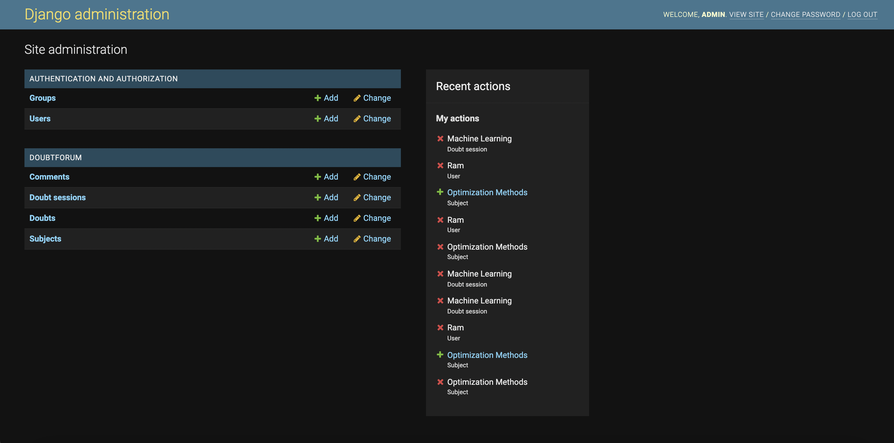
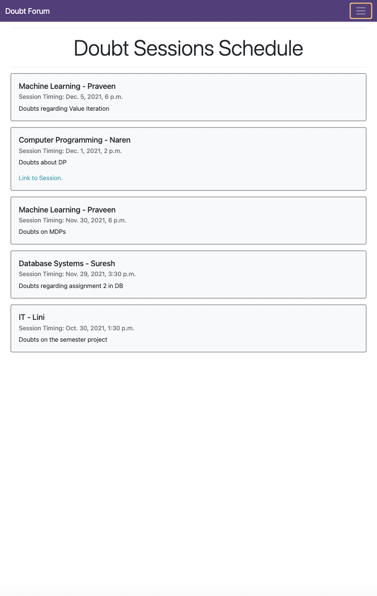
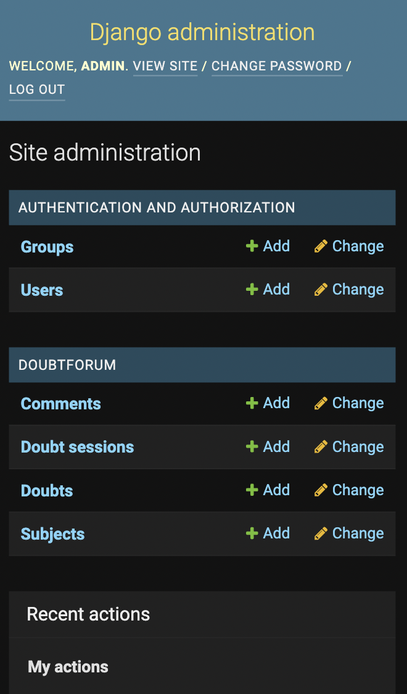

# Doubt Forum Web Application

A doubt forum to discuss issues encoutered in assignments or classes and to see the schedule of doubt sessions with the professors.

## Motivation
---
During COVID, as all classes happen online, it has become difficult for students to discuss doubts in and out of the class. You can discuss doubts with any of your classmates in an offline class, whereas you are limited to your own friend circle to discuss the doubts during an online class. 

The doubt forum helps a student reach out to all the students when they have doubts and help others clear their doubts. It also provides students with a schedule to know when the next doubt session in a course would be held.

## Prerequisites
---
- python >=3.6
- django==3.2.9

## Installation
---
Clone the repository:
```
git clone https://github.com/SriAish/WebApp_DoubtForum.git
```

## Usage
---
Enter the web application folder:
```
cd WebApp_DoubtForum
```

Run the web app server
```
python3 manage.py runserver
```

Server is deployed at: `http://127.0.0.1:8000/`

You can access the web app at the above link using any browser.

## Video Demo
See a video demo of the app [here](https://youtu.be/EGoax7NDi-c).

## UI/UX
---

### Laptop view
Home page:


Doubt full view:


Search Bar:


Search Results:


Subjects List:


Schedule:


Admin page:


### Mobile view:
Home page:


Doubt full view:


Schedule:


Admin page:

